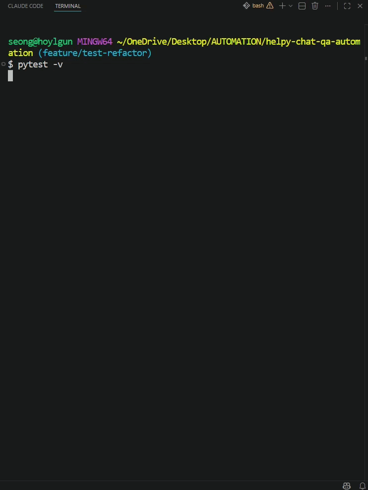
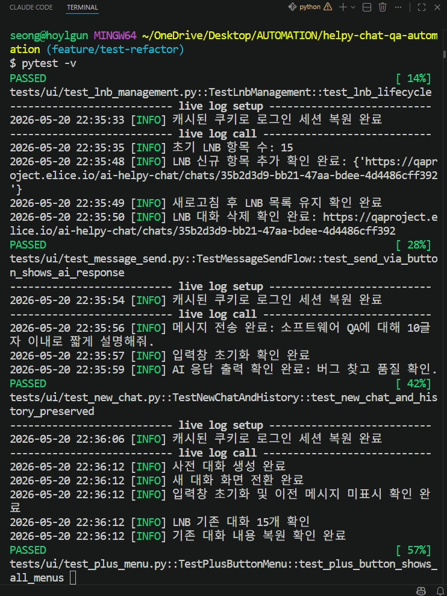
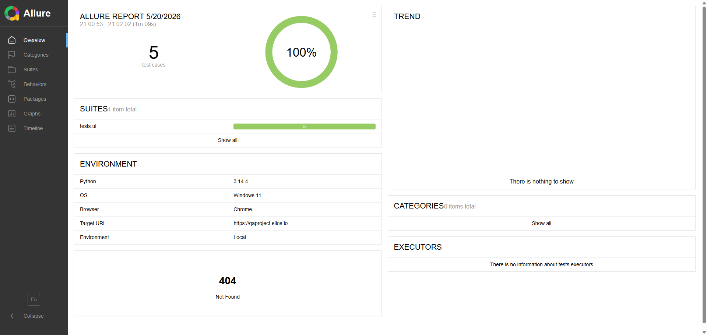
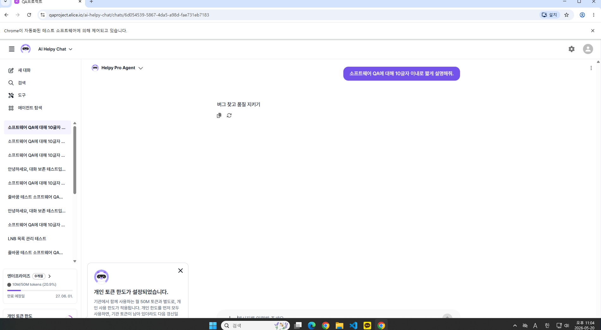

# HelpyChat QA Automation

**AI Helpy Chat** 서비스(qaproject.elice.io)를 대상으로 한 UI 자동화 테스트 포트폴리오 프로젝트입니다.

> 이 프로젝트는 Claude AI의 도움을 받아 만들었습니다.
>
> 테스트 케이스 수보다, 왜 이렇게 짜야 하는지를 이해하면서 만들고 싶었습니다.
>
> Jenkins 플러그인 서버가 중국 미러로 막혔을 때 VPN으로 우회했고, Python 경로 문제도 직접 파고들었습니다. AI가 브라우저에 테스트 단계를 오버레이로 표시하는 기능을 제안했을 때는, 자동화 목적에 불필요한 JS 실행이 매 스텝마다 추가되는 거라 판단해서 걷어냈습니다.
>
> 재현되는 버그는 skip으로 넘기지 않고 xfail로 처리했습니다. 테스트가 실행되고 실패해야, 버그가 실제로 존재한다는 걸 결과로 남길 수 있다고 생각했기 때문입니다.

---

## 데모

| pytest 실행 (시작) | pytest 실행 (완료) |
|---|---|
|  |  |

### Allure 리포트



### 테스트 대상 서비스



---

## 기술 스택

| 분류 | 사용 기술 |
|---|---|
| 언어 | Python 3.14 |
| UI 자동화 | Selenium 4, pytest |
| 리포팅 | Allure Report (allure-pytest) |
| 설계 패턴 | Page Object Model (POM) |
| 인증 우회 | Chrome DevTools Protocol (CDP) 쿠키 주입 |
| 환경 관리 | python-dotenv |
| 로깅 | Python logging |

---

## 프로젝트 구조

```
helpy-chat-qa-automation/
├── config/
│   └── config.py          # URL, 대기 시간 등 전역 상수
├── pages/
│   ├── base_page.py        # 공통 Page Object 부모 클래스 (click/safe_click/enter_text)
│   ├── login_page.py
│   ├── signup_page.py
│   └── chat_page.py
├── tests/
│   ├── ui/
│   │   ├── test_message_send.py      # TS-001
│   │   ├── test_new_chat.py          # TS-002
│   │   ├── test_input_features.py    # TS-003
│   │   ├── test_plus_menu.py         # TS-004
│   │   └── test_lnb_management.py   # TS-005
│   └── api/
│       └── test_community_api.py    # TS-006
├── test_data/
│   └── test_upload.txt    # 파일 업로드 TC용 더미 파일
├── utils/
│   └── logger.py
├── docs/
│   ├── bugs/
│   │   └── TC_009/        # 버그 재현 GIF 및 스크린샷
│   ├── test_cases.csv        # TC/TS 전체 목록
│   ├── bug-report.md         # 발견 결함 5건
│   └── troubleshooting.md    # 트러블슈팅 기록 (10건)
├── conftest.py               # Fixture 정의 (WebDriver, 인증, 스크린샷)
├── Jenkinsfile
├── pytest.ini
├── .env.example              # 환경 변수 템플릿
└── .env                      # 자격증명 (gitignore 처리, 직접 생성 필요)
```

---

## 테스트 구성

| TS ID | 테스트 스위트 | TC 수 | 방식 |
|---|---|---|---|
| TS-001 | 메시지 전송 | TC_001 | 자동화 |
| TS-002 | 새 대화 | TC_002~003 | 자동화 |
| TS-003 | 메시지 입력 기능 | TC_004~006 | 자동화 |
| TS-004 | + 버튼 메뉴 | TC_007~011 | 자동화 (TC_009 xfail — 앱 버그) |
| TS-005 | LNB 대화 목록 관리 | TC_012~014 | 자동화 |

> 전체 TC 목록: [docs/test_cases.csv](docs/test_cases.csv)

---

## 주요 구현 내용

### SSO 인증 우회 (CDP 쿠키 주입)
로그인 시 `accounts.elice.io`로 SSO 리다이렉트가 발생해 일반적인 `driver.add_cookie()` 방식으로는 도메인 오류가 발생함.  
Chrome DevTools Protocol의 `Network.setCookie`를 사용해 도메인 제약 없이 쿠키를 직접 주입하는 방식으로 해결.

### 쿠키 캐싱 (30분 TTL)
매 테스트마다 로그인 반복을 방지하기 위해 `.pytest_cache/elice_session.json`에 세션 쿠키를 저장.  
TTL(30분) 초과 또는 로그인 실패 시 캐시를 자동 삭제하고 재로그인.

### 실패 시 자동 스크린샷
`pytest_runtest_makereport` hook을 활용해 테스트 실패 시 `reports/screenshots/`에 자동 저장.

---

## 로컬 실행 방법

### 1. 의존성 설치

```bash
pip install -r requirements.txt
```

### 2. 환경 변수 설정

`.env.example`을 복사해 `.env`를 생성하고 실제 값을 입력합니다.

```bash
cp .env.example .env
```

```env
# UI 테스트용 계정
TEST_USER_ID=your_email@example.com
TEST_USER_PW=your_password

# API 테스트용 Bearer 토큰
AUTH_TOKEN=Bearer your_token_here

# API 엔드포인트
BASE_API_URL=https://your-api-domain.com
AUTH_API_URL=https://your-auth-domain.com

# 파일 다운로드 경로 (미설정 시 ~/Downloads 사용)
DOWNLOAD_DIR=/path/to/download/directory
```

### 3. 테스트 실행

```bash
# UI 테스트 전체 실행
pytest tests/ui/ -m ui -v

# 특정 테스트 파일 실행
pytest tests/ui/test_message_send.py -v
```

### 4. Allure 리포트 확인

```bash
allure serve allure-results
```

---

## 문서

- [버그 리포트](docs/bug-report.md) — 테스트 중 발견된 결함 5건 정리 (BUG-005: 이미지 다운로드 미동작, xfail 처리)
- [트러블슈팅 기록](docs/troubleshooting.md) — 자동화 구축 중 발생한 이슈 10건 정리
- [테스트 케이스 목록](docs/test_cases.csv) — TC/TS 전체 목록 (노션 DB 연동용)
