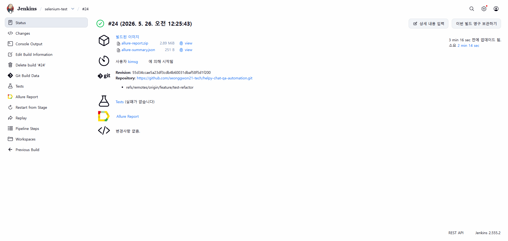
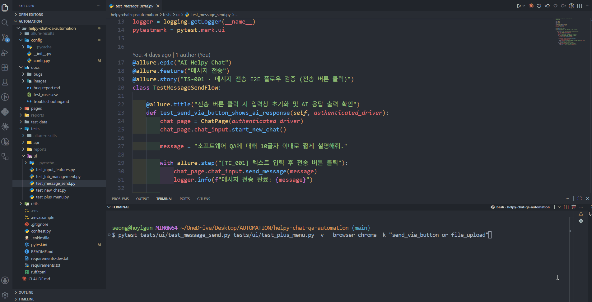

# HelpyChat QA Automation

> AI Helpy Chat(qaproject.elice.io) — UI 14개 · API 6개 **총 20 TC**, 버그 5건 추적, Jenkins + GitHub Actions 이중 CI를 갖춘 Selenium + pytest QA 자동화 포트폴리오


[](https://github.com/seonggwon21-tech/helpy-chat-qa-automation/actions/workflows/qa.yml)

> 📌 본 레포는 5인 팀 GitLab 프로젝트에서 제가 담당한 영역(채팅 UI 자동화 · 프레임워크 설계)을 개인 포트폴리오로 정리한 것입니다.

> **Claude AI를 적극 활용해** 설계·구현 전 과정을 진행했습니다.
>
> 테스트 케이스 수보다, 왜 이렇게 짜야 하는지를 이해하면서 만들고 싶었습니다.
> Component Object Pattern 도입도, fixture scope를 `session`/`function`으로 나눈 것도 — 단순히 동작하게 만드는 것보다 설계 의도를 이해하는 데 더 많은 시간을 썼습니다.
>
> Jenkins 플러그인 서버가 중국 미러로 막혔을 때 VPN으로 우회했고, Python 경로 문제도 직접 파고들었습니다.
>
> 재현되는 버그는 skip으로 넘기지 않고 xfail로 처리했습니다. 테스트가 실행되고 실패해야, 버그가 실제로 존재한다는 걸 결과로 남길 수 있다고 생각했기 때문입니다.
>
> 테스트가 통과했는지뿐 아니라 어느 단계에서 왜 실패했는지 보고 싶어서 Allure를 썼습니다. 터미널에서 테스트 흐름을 직접 눈으로 보고 싶어서 logging을 붙였고, Jenkins와 GitHub Actions는 둘 다 경험해보고 싶어서 함께 구성했습니다 — Jenkins는 기능이 가장 많고, GitHub Actions는 편하고 빠르게 쓸 수 있었습니다.

---

## 데모

| pytest 실행 (시작) | pytest 실행 (완료) |
|---|---|
|  |  |

### Jenkins CI — 빌드 성공



### Allure 리포트


### 테스트 실행 장면



---

## 프로젝트 개요

**5인 팀 · UI 14개 + API 6개 = 총 20 TC · 18 passed · 버그 5건 발견 · CI 파이프라인 2종**

엘리스의 AI 채팅 서비스(qaproject.elice.io)를 대상으로 한 QA 자동화 포트폴리오입니다. 사용자가 메시지를 보내고, AI가 응답하고, 파일을 업로드하고, 대화 목록을 관리하는 핵심 흐름을 자동으로 검증합니다. API 인증 음성(negative) 케이스까지 포함해 UI와 API 두 트랙을 모두 커버합니다.

5인 팀 프로젝트에서 **새 대화 기능 UI 테스트 자동화와 프레임워크 설계 전반**을 담당했습니다.

단순히 동작하는 스크립트가 아니라, 나중에 테스트를 추가하거나 UI가 바뀌어도 유지보수할 수 있는 구조를 목표로 설계했습니다. Page Object Model 위에 Component Object Pattern을 얹어 UI 영역별 책임을 나눴고, CDP 쿠키 주입으로 매 테스트마다 반복되던 SSO 로그인 대기를 없앴습니다.

---

## 기술 스택

| 분류 | 사용 기술 | 선택 이유 |
|---|---|---|
| 언어 | Python 3.14 | 표준 라이브러리만으로 fixture 캐시·CDP 통신 구현 |
| UI 자동화 | Selenium 4 + CDP | `execute_cdp_cmd("Network.setCookie")`로 도메인 진입 전에도 쿠키 주입 → SSO 리다이렉트 우회 |
| 크로스 브라우저 | Chrome · Edge · Firefox | `--browser` CLI 옵션으로 단일 또는 3브라우저 동시 실행; Firefox CDP 미지원 문제는 `add_cookie` 폴백으로 해결 |
| API 자동화 | requests | `Session` 객체로 헤더·연결 풀 재사용, 인증 음성(negative) 케이스 포함 |
| 테스트 프레임워크 | pytest 8.x | fixture scope(`session`/`function`) 분리, marker 기반 슬라이스(`ui`/`api`/`slow`), `addoption` + `generate_tests` 훅으로 브라우저 파라미터화 |
| 리포팅 | Allure Report | epic/feature/story/step 4계층 + 동적 브라우저명 환경 정보·실패 스크린샷 자동 첨부 |
| 설계 패턴 | Page Object Model + Component Object Pattern | POM으로 UI 동작과 테스트 로직을 분리하고, COP로 ChatPage를 역할별 컴포넌트(ChatInput · PlusMenu · Lnb)로 세분화 |
| 정적 분석 | Ruff | import 정렬·미사용 변수·f-string 등 코드 품질 자동 검사, CI Lint job으로 push마다 실행 |
| CI/CD | Jenkins + GitHub Actions | Jenkins: UI·API 분리 실행 + Allure publish / GHA: Lint → API Tests → UI Tests 3-job 파이프라인 |
| 환경 관리 | python-dotenv | `.env`로 자격증명·URL을 코드와 분리, `.gitignore` 처리 |
| 로깅 | Python logging | 공통 로거로 테스트 흐름을 stdout에 기록, `LOG_FILE` 환경변수로 파일 로그 추가 가능 |

---

## 프로젝트 구조

```
helpy-chat-qa-automation/
├── config/
│   └── config.py              # URL, 대기 시간 등 전역 상수 (BASE_UI_URL 환경변수 오버라이드 가능)
├── pages/                     # Page Object Model + Component Object Pattern
│   ├── base_page.py           # 방어적 클릭/입력 + @allure.step 자동 데코레이션
│   ├── login_page.py          # SSO 로그인 흐름
│   ├── signup_page.py         # 약관 동의 후처리
│   ├── chat_page.py           # 파사드(Facade) — 세 컴포넌트 조합 + wait_up_to()
│   └── components/            # Component Object Pattern
│       ├── chat_input_component.py   # 채팅 입력·전송·AI 응답 대기
│       ├── plus_menu_component.py    # + 버튼 메뉴(파일·이미지·PPT·웹 검색), upload_file(), select_plus_menu_item()
│       └── lnb_component.py          # LNB 대화 목록 조회·삭제, wait_for_lnb_loaded(), get_lnb_hrefs()
├── tests/
│   ├── ui/
│   │   ├── test_message_send.py      # TS-001
│   │   ├── test_new_chat.py          # TS-002
│   │   ├── test_input_features.py    # TS-003
│   │   ├── test_plus_menu.py         # TS-004
│   │   └── test_lnb_management.py   # TS-005
│   └── api/
│       └── test_community_api.py    # TS-006 (TC_015~020, negative 케이스 포함)
├── test_data/
│   └── test_upload.txt        # 파일 업로드 TC용 더미 파일
├── utils/
│   ├── logger.py              # 공통 로거 (LOG_FILE 환경변수로 파일 핸들러 활성화)
│   └── download.py            # 다운로드 완료 감지 (Chrome .crdownload / Firefox .part 병행)
├── docs/
│   ├── bugs/
│   │   └── TC_009/            # 버그 재현 GIF 및 스크린샷
│   ├── images/                # README 데모 이미지
│   ├── test_cases.csv         # TC/TS 전체 목록
│   ├── bug-report.md          # 발견 결함 5건
│   └── troubleshooting.md     # 트러블슈팅 기록 (16건)
├── reports/                   # 실패 시 자동 저장되는 스크린샷
├── allure-results/            # Allure raw 데이터 (environment.properties 포함)
├── .github/
│   └── workflows/
│       └── qa.yml             # GitHub Actions — Lint → API Tests → UI Tests 3-job 파이프라인
├── conftest.py                # Fixture 정의 (크로스 브라우저, 인증, 쿠키 캐싱, 실패 훅)
├── ruff.toml                  # Ruff 정적 분석 설정 (E/F/W/I rules, isort)
├── requirements.txt           # 런타임 의존성
├── requirements-dev.txt       # 개발·CI 전용 도구 (Ruff)
├── Jenkinsfile
├── pytest.ini
├── .env.example               # 환경 변수 템플릿
└── .env                       # 자격증명 (gitignore 처리, 직접 생성 필요)
```

---

## 테스트 구성

UI 5개 시나리오 14개 TC + API 1개 시나리오 6개 TC, **총 20개 TC**.

| TS ID | 테스트 스위트 | TC | 설명 |
|---|---|---|---|
| TS-001 | 메시지 전송 E2E | TC_001 | 사용자 메시지 입력 → 전송 → AI 응답 노드 확인까지 단일 E2E 검증 |
| TS-002 | 새 대화 전환 | TC_002~003 | 새 대화 클릭 후 화면 초기화 확인, LNB에서 기존 대화 복원 확인 |
| TS-003 | 입력창 동작 | TC_004~006 | 빈 입력 차단, Shift+Enter 줄바꿈(미전송), Enter 전송 후 AI 응답 출력 |
| TS-004 | + 버튼 메뉴 | TC_007~011 | 파일 업로드 칩 노출, 이미지·PPT 생성, 웹 검색 (**TC_009는 `xfail(strict=True)`로 버그 추적**) |
| TS-005 | LNB 대화 목록 관리 | TC_012~014 | 가상화 환경에서 새로고침 보존·삭제를 href 기준으로 검증 |
| TS-006 | 에이전트 API & 인증 | TC_015~020 | 에이전트 목록·수·상세 조회 + 미인증·유효하지 않은 토큰·잘못된 인증 스킴 음성(negative) 케이스 |

> 전체 TC 목록: [docs/test_cases.csv](docs/test_cases.csv)  
> `pytest -m "ui and not slow"`로 PR 단위 빠른 피드백 루프를 지원합니다.

---

## 주요 구현 내용

### 1. Component Object Pattern — ChatPage 역할별 분리

**어떤 문제가 있었나.** POM을 처음 적용할 때는 채팅 화면 전체를 `ChatPage` 하나로 관리했습니다. 테스트 케이스가 늘면서 채팅 입력·전송, + 버튼 메뉴, 왼쪽 대화 목록(LNB)이 모두 한 파일에 쌓였고, 클래스가 400줄에 근접했습니다. 파일 업로드 테스트(TC_008)를 작성하다가 "이 메서드는 PlusMenu의 기능인가, ChatPage의 기능인가"를 스스로도 헷갈리기 시작했을 때 분리를 결심했습니다.

**무엇을 했나.** 화면의 UI 영역별로 전담 컴포넌트 클래스를 만들었습니다.

| 컴포넌트 | 담당 화면 영역 | 주요 역할 |
|---|---|---|
| `ChatInputComponent` | 채팅 입력창 | 메시지 입력·전송, AI 응답 대기 |
| `PlusMenuComponent` | + 버튼 팝업 | 파일·이미지·PPT 업로드, 웹 검색 |
| `LnbComponent` | 왼쪽 대화 목록 | 목록 로딩 대기, 대화 URL 수집·삭제 |

`ChatPage`는 이 세 컴포넌트를 속성으로 들고 있는 **조율자** 역할만 합니다. 로케이터를 직접 갖거나 클릭하지 않고, 테스트에서 `chat_page.chat_input.send_message()` 형태로 접근합니다.

```
ChatPage (조율자)
├── self.chat_input  →  ChatInputComponent   메시지 전송 · AI 응답 대기
├── self.plus_menu   →  PlusMenuComponent    파일 · 이미지 · PPT · 웹검색
└── self.lnb         →  LnbComponent         대화 목록 조회 · 삭제
```

다운로드 완료 감지(`wait_for_download`)는 특정 UI 영역과 무관한 유틸리티라 `utils/download.py`로 따로 뺐습니다.

**왜 이 구조가 좋은가.** UI가 바뀌었을 때 수정 범위가 명확해집니다. + 버튼 위치가 바뀌면 `PlusMenuComponent`만 열면 됩니다. 분리 전에는 어디를 고쳐야 하는지 `ChatPage` 전체를 읽어야 했습니다.

### 2. 크로스 브라우저 지원 — pytest_addoption + pytest_generate_tests

**무엇을 했나.** `--browser` CLI 옵션으로 Chrome · Edge · Firefox 3종 중 하나 또는 전체를 실행할 수 있습니다. `pytest_addoption`으로 옵션을 등록하고, `pytest_generate_tests`로 `--browser all` 지정 시 모든 테스트를 3브라우저로 자동 파라미터화합니다.

```python
# conftest.py
def pytest_addoption(parser):
    parser.addoption("--browser", choices=["chrome", "edge", "firefox", "all"], default="chrome")

def pytest_generate_tests(metafunc):
    if "browser" in metafunc.fixturenames:
        opt = metafunc.config.getoption("--browser")
        browsers = ["chrome", "edge", "firefox"] if opt == "all" else [opt]
        metafunc.parametrize("browser", browsers)
```

**Firefox CDP 미지원 대응.** Firefox는 `execute_cdp_cmd`를 지원하지 않습니다. `authenticated_driver` fixture에서 `browser == "firefox"` 분기를 두어 도메인 이동 후 Selenium 표준 `add_cookie`로 폴백합니다. 다운로드 설정도 Chromium 계열의 `prefs` dict 대신 `options.set_preference`로 주입합니다.

**`temp_download_dir` fixture.** 브라우저 인스턴스마다 pytest의 `tmp_path`를 기반으로 격리된 다운로드 디렉터리를 생성해 `driver` fixture에 주입합니다. 테스트 간 다운로드 파일 충돌이 없고, Firefox · Chrome 모두 동일한 경로를 가리킵니다.

```python
# 실행 예시
pytest --browser chrome          # Chrome 단독
pytest --browser firefox         # Firefox 단독
pytest --browser all -m "ui"     # 3브라우저 × UI 전체
```

**fixture 의존성 체인.** `browser` 픽스처는 트랜지티브 의존성을 통해 모든 UI 테스트에 자동 전파됩니다.

```
browser  (pytest_generate_tests가 값 주입)
  └── temp_download_dir  (tmp_path 기반 브라우저별 격리 디렉터리)
        └── driver  (Chrome | Edge | Firefox 인스턴스 생성)
              └── authenticated_driver  (SSO 쿠키 캐싱 → 로그인 검증)
                    ├── seeded_chat  (사전 대화 생성 → ChatPage 반환)
                    └── 개별 테스트 (test_*)
```

테스트 함수가 `browser`를 직접 인자로 받지 않아도 `driver`를 통해 픽스처 체인에 편입되므로, `pytest_generate_tests`의 파라미터화가 모든 UI 테스트에 투명하게 전파됩니다.

### 3. send_keys 풀패스 파일 업로드 — OS 파일 다이얼로그 우회

**무엇을 했나.** 기존 `Page.setInterceptFileChooser` CDP 방식은 Chrome 148에서 미지원 상태가 되었습니다. `PlusMenuComponent.upload_file()`은 `select_plus_menu_item()`으로 + 메뉴를 닫은 뒤, 숨겨진 `input[type='file']`을 JS로 강제 노출하고 절대 경로를 `send_keys`로 직접 주입합니다.

```python
def upload_file(self, file_path):
    self.select_plus_menu_item(self.MENU_FILE_UPLOAD)   # 팝오버 닫힘까지 대기
    file_input = self.wait.until(
        EC.presence_of_element_located(self.FILE_INPUT)
    )
    self.driver.execute_script(
        "arguments[0].removeAttribute('hidden');"
        "arguments[0].style.display='block';"
        "arguments[0].style.visibility='visible';",
        file_input,
    )
    file_input.send_keys(str(Path(file_path).resolve()))   # 절대 경로 직접 주입
```

**왜 이 방식인가.** OS 파일 다이얼로그는 네이티브 모달로 브라우저 DOM을 블로킹합니다. `send_keys`를 `input[type='file']`에 직접 호출하면 다이얼로그 없이 파일 경로가 설정되므로, Chrome · Edge · Firefox 모두 동일한 코드로 동작하고 headless 환경에서도 안정적입니다. 단독 실행 결과 **PASSED** 확인.

### 4. select_plus_menu_item — 팝오버 닫힘 대기로 Firefox 타이밍 이슈 해결

**무엇을 했나.** `+` 메뉴 항목을 선택하는 반복 패턴(open_menu → click → 다음 동작)을 `select_plus_menu_item()`으로 추출하고, 클릭 직후 `PLUS_MENU_POPOVER`(`ul[role='menu']`)가 DOM에서 사라질 때까지 대기하는 로직을 추가했습니다.

```python
def select_plus_menu_item(self, menu_locator: tuple[str, str]):
    self.open_menu()
    self.click(menu_locator)
    self.wait_until_invisible(self.PLUS_MENU_POPOVER)   # Firefox 팝오버 잔재 방지
```

**왜 이 방식인가.** Firefox는 Chromium 대비 MUI 팝오버 애니메이션 처리가 느려, 팝오버가 DOM에 남아 있는 상태에서 다음 동작이 실행되면 `ElementClickInterceptedException`이 발생합니다. 팝오버 소멸을 명시적으로 기다리는 게 `time.sleep`보다 결정론적이고 정확합니다.

### 5. wait_for_download — Chrome · Firefox 임시 확장자 병행 감지

**무엇을 했나.** `utils/download.py`의 `wait_for_download()`는 다운로드 완료를 판단할 때 `.crdownload`(Chrome/Edge)와 `.part`(Firefox) 두 임시 확장자를 모두 감지합니다. 초기 구현은 `ChatPage` 정적 메서드였으나, Page 레이어와 무관한 유틸리티가 Page 클래스에 위치하는 SRP 위반을 해소하기 위해 `utils/download.py`로 분리했습니다. 테스트는 `from utils.download import wait_for_download`로 직접 임포트합니다.

```python
# utils/download.py
def wait_for_download(download_dir: Path, before_count: int, timeout: int = 60) -> bool:
    for _ in range(timeout):
        current = list(download_dir.iterdir())
        if len(current) > before_count and not any(
            f.name.endswith((".crdownload", ".part")) for f in current
        ):
            return True
        time.sleep(1)
    return False
```

### 6. LNB 안정화 — wait_for_lnb_loaded + get_lnb_hrefs 재시도

**무엇을 했나.** LNB는 가상화(virtualization)로 렌더링되어 DOM 항목 수가 로드 중 변동합니다. `LnbComponent.wait_for_lnb_loaded()`는 항목 수가 3회 연속 동일할 때까지 폴링해 안정화를 기다리며, 타임아웃 시 `TimeoutError`를 발생시켜 침묵 실패를 방지합니다. `get_lnb_hrefs()`(구 `get_chat_hrefs()`)는 JS로 href를 원자적으로 수집합니다. 초기 구현에 포함했던 `StaleElementReferenceException` 재시도 로직은 `execute_script()`가 DOM 요소 참조를 반환하지 않아 실제로 발생하지 않는 dead code임을 확인하고 제거했습니다.

```python
def wait_for_lnb_loaded(self, timeout: int = 10) -> None:
    stable_rounds, prev_count = 0, -1
    deadline = time.time() + timeout
    while time.time() < deadline:
        current = len(self.driver.find_elements(*self.LNB_CHAT_ITEMS))
        stable_rounds = stable_rounds + 1 if current == prev_count else 0
        if stable_rounds >= 3:
            return
        prev_count = current
        time.sleep(0.3)
    raise TimeoutError(f"LNB 항목 수가 {timeout}초 내에 안정화되지 않았습니다.")
```

**왜 이 방식인가.** 단순 `until(lambda d: len(...) > 0)` 조건은 첫 항목이 렌더링되자마자 통과합니다. 가상화 LNB는 스크롤·리렌더 중에도 항목 수가 변하므로 3회 안정화 확인이 필요합니다. `TimeoutError` raise는 LNB가 끝까지 안정화되지 않을 때 원인 불명의 assertion 실패 대신 명확한 타임아웃 메시지를 남깁니다.

### 7. SSO 인증 우회 — CDP 쿠키 주입 + 30분 TTL 캐싱

**무엇을 했나.** 매 테스트마다 발생하는 `account.elice.io → qaproject.elice.io` SSO 리다이렉트 비용(약 5~8초)을 제거하기 위해, 로그인 성공 시점의 쿠키를 30분 TTL 파일 캐시(`.pytest_cache/elice_session.json`)에 저장하고 이후 테스트에서는 캐시를 재사용합니다. 캐시가 만료되거나 로그인 검증에 실패하면 캐시를 즉시 무효화하고 정상 로그인 경로로 폴백하는 **self-healing** 구조입니다.

**왜 CDP인가 / Firefox 폴백.** Selenium의 표준 `driver.add_cookie()`는 해당 도메인을 먼저 방문해야만 동작합니다. Chromium 계열에서는 `Network.setCookie` CDP 커맨드로 도메인 진입 전에 쿠키를 주입해 이 문제를 해결합니다. Firefox는 CDP를 지원하지 않으므로 도메인 이동(`driver.get(base_url)`) 후 `add_cookie()`로 주입하는 폴백 경로를 분기 처리했습니다.

```python
if browser == "firefox":
    driver.get(base_url)
    for cookie in cached_cookies:
        driver.add_cookie({**cookie, "domain": cookie["domain"].lstrip(".")})
else:
    driver.execute_cdp_cmd("Network.enable", {})
    for cookie in cached_cookies:
        driver.execute_cdp_cmd("Network.setCookie", {...})
```

### 8. 방어적 클릭 패턴 — React/MUI flaky test 흡수

**무엇을 했나.** `BasePage.click()`은 `visibility → scrollIntoView → element_to_be_clickable → click()` 4단계를 거칩니다. `ElementClickInterceptedException` 또는 `StaleElementReferenceException` 발생 시 요소를 재조회한 뒤 JavaScript click으로 폴백합니다.

**왜 이 방식인가.** 테스트 대상이 React + MUI로 구성된 SPA라 모달/툴팁/리렌더 사이클로 인해 일반 click이 가로채이거나 요소가 다시 부착되는 상황이 빈번합니다. "그냥 sleep을 늘린다" 대신 **인터셉트/스테일이라는 구체적인 예외만 폴백 경로로 처리**해, flaky test를 줄이면서 실제 결함이 sleep 뒤에 가려지지 않도록 했습니다.

`BasePage`는 `wait_up_to(timeout)` 메서드도 제공합니다. 기존에는 AI 응답·PPT 생성처럼 긴 대기가 필요한 TC마다 `long_wait = WebDriverWait(authenticated_driver, n)`을 인라인으로 선언했으나, 이를 `chat_page.wait_up_to(n)`으로 교체해 드라이버 참조 중복을 제거하고 WebDriver 접근을 `BasePage` 한 곳으로 집약합니다.

```python
# BasePage
def wait_up_to(self, timeout: int) -> WebDriverWait:
    return WebDriverWait(self.driver, timeout)

# 테스트에서
long_wait = chat_page.wait_up_to(600)   # PPT 생성 최대 대기
long_wait = chat_page.wait_up_to(60)    # 일반 AI 응답 대기
```

### 9. 알려진 버그의 xfail + Allure issue 추적

**무엇을 했나.** TC_009(다운로드 응답이 디스크에 저장되지 않는 결함)를 발견한 후, 테스트를 끄거나 주석 처리하지 않고 `@pytest.mark.xfail(reason=..., strict=True)`로 표시했습니다. `@allure.issue()`로 이슈 링크를 연결하고, `docs/bugs/TC_009/`에 재현 스크린샷·GIF를 보관해 Allure 첨부로 자동 연결합니다.

**왜 이 방식인가.** `strict=True`는 버그가 수정되어 테스트가 **예상 외로 통과(XPASS)할 경우 빌드를 실패**시킵니다. 회귀가 아닌 "수정"도 자동 감지되어 케이스를 정식 통과로 승격시키는 트리거가 됩니다.

### 10. 실패 시 자동 스크린샷

**무엇을 했나.** `pytest_runtest_makereport` hook을 `hookwrapper`로 감싸 `call`/`setup` 단계 어디에서 실패하든 드라이버를 추출해 스크린샷을 저장합니다. 이미지를 디스크(`reports/screenshots/`)와 Allure attach **양쪽에 동시 기록**해, Jenkins 빌드가 끝난 후에도 증거가 보존됩니다.

```python
@pytest.hookimpl(tryfirst=True, hookwrapper=True)
def pytest_runtest_makereport(item, call):
    outcome = yield
    report = outcome.get_result()
    if report.when in ("call", "setup") and report.failed:
        driver = item.funcargs.get("authenticated_driver") or item.funcargs.get("driver")
        if driver:
            safe_name = item.nodeid.replace("/", "_").replace("::", "_").replace("\\", "_")
            driver.save_screenshot(f"reports/screenshots/{safe_name}.png")
            allure.attach(...)
```

### 11. fixture scope의 의식적 분리

- `auth_token` → **`scope="session"`**: API 트랙 전체에서 1회 로드
- `api_session` → **`scope="function"`**: 테스트별 헤더·연결 격리 후 close
- `driver` / `authenticated_driver` / `temp_download_dir` → **`scope="function"`**: 브라우저·다운로드 경로 테스트 간 완전 격리

자원별 비용과 격리 요구를 따로 판단해, `session`/`function`을 혼용하는 결정을 내렸습니다.

**`seeded_chat` fixture — 사전 조건 준비 로직의 캡슐화.** TS-002처럼 "기존 대화가 이미 있는 상태"를 전제로 하는 TC는 테스트 본문에 사전 준비 로직이 섞이면 TC 핵심 시나리오가 묻힙니다. `seeded_chat`은 `authenticated_driver`를 받아 메시지를 하나 전송하고 AI 응답이 완료된 `ChatPage`를 반환합니다. TC는 반환된 인스턴스를 받아 검증에만 집중합니다.

```python
@pytest.fixture(scope="function")
def seeded_chat(authenticated_driver):
    chat_page = ChatPage(authenticated_driver)
    chat_page.send_message("안녕하세요, 대화 보존 테스트입니다.")
    chat_page.wait_for_ai_response()
    return chat_page   # driver 속성도 접근 가능: seeded_chat.driver

# 테스트에서는 사전 준비 없이 바로 TC 검증
def test_new_chat_and_history_preserved(self, seeded_chat):
    chat_page = seeded_chat
    inp.start_new_chat()          # TC_002 시작
    ...
```

### 12. Ruff 정적 분석 — CI 코드 품질 자동화

**무엇을 했나.** GitHub Actions에 `Lint (Ruff)` job을 추가해 push마다 import 정렬(isort), 미사용 변수(`F401`), f-string 오용(`F541`), 공백 규칙(`E`/`W`) 등을 자동으로 검사합니다.

```toml
# ruff.toml
select = ["E", "F", "W", "I"]   # pycodestyle + pyflakes + isort
```

```yaml
# .github/workflows/qa.yml
lint:
  steps:
    - run: pip install ruff
    - run: ruff check .          # 위반 발생 시 job 실패 → 이후 테스트 job 차단
```

**왜 Ruff인가.** flake8 + black + isort를 별도로 설치·설정하면 CI 실행 시간이 늘고 설정 파일도 세 개가 됩니다. Rust로 작성된 Ruff는 동일 규칙을 단일 바이너리로 처리해 **기존 대비 10~100× 빠른 속도**를 내면서 설정을 `ruff.toml` 하나로 통합합니다. Lint job이 통과해야만 API · UI 테스트 job이 실행되는 파이프라인 순서로 명백한 코드 품질 문제를 조기 차단합니다.

### 13. API 음성(negative) 케이스 — 게이트웨이 409 래핑 분해

**무엇을 했나.** 에이전트 API의 인증 검증(TS-006)은 양성 케이스뿐 아니라 세 가지 음성 시나리오를 포함합니다: 인증 헤더 완전 생략(TC_018), 서명 불일치 JWT(TC_019), 잘못된 인증 스킴 Basic(TC_020). TC_019에서 발견한 특이점은, 백엔드가 반환하는 403이 API 게이트웨이에 의해 **409로 래핑**된다는 점입니다. 단순 상태 코드 비교로는 인증 거부 여부를 판단할 수 없어, 409 응답 body를 역으로 파고들어 내부 상태를 확인합니다.

```python
# TC_019 — 유효하지 않은 JWT 검증
assert response.status_code in (401, 403, 409)

if response.status_code == 409:          # 게이트웨이 래핑 경로
    inner_status = (
        response.json()
        .get("detail", {})
        .get("resp_json", {})
        .get("_result", {})
        .get("status_code")
    )
    assert inner_status == 403           # 실제 인증 실패임을 body로 확인
```

**왜 이렇게 했나.** 게이트웨이 래핑은 테스트 환경마다 달라질 수 있어 허용 상태 코드를 `in (401, 403, 409)`으로 열어두고, 409인 경우에만 body를 검증하는 조건부 분기를 택했습니다. 단순히 통과율을 높이려고 `assert True`로 넘기는 대신, **시스템 내부 구조를 이해한 상태에서 인증 거부가 실제로 발생했음을 검증**하는 것이 목적입니다.

---

## 로컬 실행 방법

### 1. 의존성 설치

```bash
pip install -r requirements.txt

# 정적 분석 도구 (선택)
pip install -r requirements-dev.txt
```

### 2. 환경 변수 설정

`.env.example`을 복사해 `.env`를 생성하고 실제 값을 입력합니다.

```bash
cp .env.example .env
```

```env
# UI 테스트 계정
TEST_USER_ID=your_email@example.com
TEST_USER_PW=your_password

# API 인증 토큰 (브라우저 Network 탭 Authorization 헤더에서 복사)
AUTH_TOKEN=your_bearer_token

# API 엔드포인트
BASE_API_URL=https://your-api-domain.com
```

### 3. 테스트 실행

```bash
# Chrome (기본) — UI 테스트 (slow 제외, PR 빠른 피드백용)
pytest -m "ui and not slow" --tb=short -v

# Firefox로 전체 UI 실행
pytest -m ui --browser firefox

# Chrome · Edge · Firefox 3브라우저 동시 실행
pytest --browser all -m ui

# API 테스트
pytest -m api --tb=short -v

# 특정 파일
pytest tests/ui/test_message_send.py -v

# 정적 분석
ruff check .
```

### 4. Allure 리포트 확인

```bash
allure serve allure-results
```

### 5. CI 실행

**Jenkins** — `Jenkinsfile` 기반 Declarative Pipeline으로 UI · API 테스트를 순차 실행하고 Allure Report를 자동 생성합니다. `AUTH_TOKEN`은 Jenkins Credentials (Secret text)에 등록해 주입하며, 코드에는 노출되지 않습니다.

**GitHub Actions** — `.github/workflows/qa.yml`은 `main` · `develop` 브랜치 push 시 **Lint → API Tests → UI Tests** 3개 job을 자동 실행합니다.

---

## 테스트 결과

| 구분 | TC 수 | 결과 |
|---|---|---|
| UI (TS-001 ~ TS-005) | 14 | **12 passed · 1 skipped(CI headless) · 1 xfail** (TC_009: 다운로드 미저장 버그) |
| API (TS-006) | 6 | **6 passed** |
| **총계** | **20** | **18 passed · 1 skipped · 1 xfail · 0 failed** |

### 크로스 브라우저 호환성

`--browser all` 실행 기준 설계 지원 범위입니다. Chrome 단독 실행은 검증 완료, Edge · Firefox는 설계상 동등 지원을 목표로 합니다.

| TS | 주요 TC | Chrome | Edge | Firefox | 비고 |
|---|---|:---:|:---:|:---:|---|
| TS-001~003 | TC_001~006 메시지·입력 | ✅ | ✅ | ✅ | |
| TS-004 | TC_007 + 메뉴 노출 | ✅ | ✅ | ✅ | |
| TS-004 | TC_008 파일 업로드 | ✅ | ✅ | ✅ | send_keys 풀패스로 OS 다이얼로그 우회 |
| TS-004 | TC_009 이미지 다운로드 | xfail | xfail | xfail | 앱 버그, 브라우저 무관 |
| TS-004 | TC_010 PPT 생성 | ✅ | ✅ | ✅ | `.part` 감지로 Firefox 다운로드 완료 판별 |
| TS-004 | TC_011 웹 검색 | ✅ | ✅ | ✅ | |
| TS-005 | TC_012~014 LNB 관리 | ✅ | ✅ | ✅ | `select_plus_menu_item` 팝오버 대기 적용 |
| TS-006 | TC_015~020 API | ✅ | — | — | 브라우저 독립 (requests 기반) |

> Firefox 쿠키 주입은 `add_cookie` 폴백, 다운로드 설정은 `options.set_preference`로 처리해 CDP 의존 없이 동등하게 동작합니다.

### Allure 리포트 구성

- **환경 정보**: Python 버전, OS, 동적 브라우저명(`--browser` 옵션 반영), Target URL, Git Commit, Build Number
- **4계층 트리**: `epic("AI Helpy Chat") → feature("메시지 전송") → story("TS-001 · …") → step("[TC_001] …")`
- **실패 첨부**: 모든 실패 케이스에 자동 스크린샷
- **xfail 첨부**: TC_009의 재현 스크린샷 + GIF(`docs/bugs/TC_009/`)와 `@allure.issue` 링크

### 발견 결함

| ID | 시나리오 | 현상 | 추적 방식 |
|----|---|---|---|
| TC_009 | TS-004 플러스 메뉴 | 다운로드 응답이 디스크에 저장되지 않음 | `xfail(strict=True)` + `@allure.issue` + 재현 증거(스크린샷·GIF) |

---

## 문서

- [버그 리포트](docs/bug-report.md) — 테스트 중 발견된 결함 5건 정리 (BUG-005: 이미지 다운로드 미동작, xfail 처리)
- [트러블슈팅 기록](docs/troubleshooting.md) — 자동화 구축 중 발생한 이슈 16건 정리
- [테스트 케이스 목록](docs/test_cases.csv) — TC/TS 전체 목록 (노션 DB 연동용)

---

> 본 프로젝트는 **테스트 시간 = 비용**, **실패는 디버깅 가능해야 한다**, **자동화 ≠ 통과율 100%**, **운영 환경을 의식한다**는 네 가지 원칙으로 설계되었습니다.
